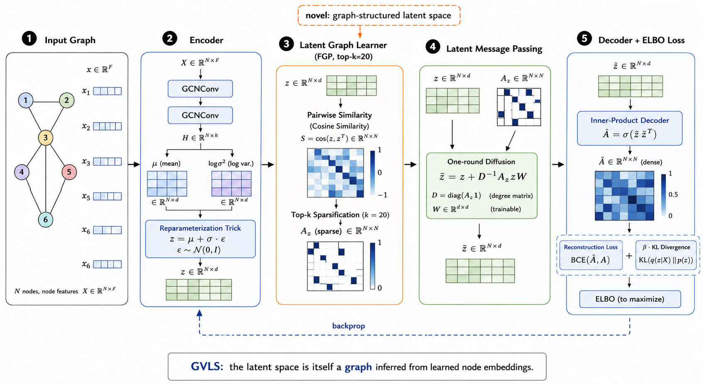

# Graph Variational Latent Space (GVLS)

A variational autoencoder where the latent space is **graph-structured** rather than flat Euclidean. Instead of mapping each node to an independent Gaussian, GVLS infers a sparse graph over the latent embeddings and refines them via message passing — learning relational structure at the latent level.



## How it works

1. **GCN Encoder** — two-layer GCN reads node features and the input graph, producing per-node mean μ and log-variance log σ² in a latent space. Samples z via reparameterization.
2. **Latent Graph Learner** — builds a sparse adjacency A_z over the latent vectors using pairwise similarity (attention, FGP cosine, or NRI), keeping the top-k neighbors per node.
3. **Latent Message Passing** — one round of diffusion on A_z refines z into z̃, letting nodes aggregate information from their latent neighbors.
4. **Inner-Product Decoder** — reconstructs the adjacency as  = σ(z̃ z̃ᵀ).
5. **ELBO Loss** — reconstruction BCE + β·KL, with optional graph-MRF prior that encodes the latent graph structure into the regularization term.

## Results

### Link Prediction — AUC

Baselines from Ahn & Kim, *"Variational Graph Normalized Autoencoders"*, CIKM 2021.

| Dataset | Train | GAE | LGAE | ARGA | GIC | sGraph | GNAE | VGNAE | **GVLS** |
|---------|-------|-----|------|------|-----|--------|------|-------|----------|
| Cora | 20% | 0.782 | 0.866 | 0.795 | 0.880 | 0.845 | 0.887 | **0.890** | 0.870 |
| Cora | 40% | 0.856 | 0.908 | 0.844 | 0.914 | 0.840 | 0.926 | **0.929** | 0.887 |
| Cora | 80% | 0.922 | 0.938 | 0.919 | 0.933 | 0.885 | **0.956** | 0.954 | 0.917 |
| CiteSeer | 20% | 0.786 | 0.906 | 0.750 | 0.930 | 0.928 | **0.946** | 0.941 | 0.941 |
| CiteSeer | 40% | 0.836 | 0.925 | 0.832 | 0.936 | 0.936 | 0.956 | **0.961** | 0.942 |
| CiteSeer | 80% | 0.894 | 0.955 | 0.904 | 0.962 | 0.963 | 0.965 | **0.970** | 0.929 |
| PubMed | 20% | 0.937 | 0.946 | 0.936 | 0.950 | 0.837 | 0.950 | **0.951** | 0.835 |
| PubMed | 40% | 0.959 | 0.962 | 0.955 | 0.958 | 0.876 | 0.963 | **0.964** | 0.884 |
| PubMed | 80% | 0.967 | 0.974 | 0.973 | 0.960 | 0.896 | 0.975 | **0.976** | 0.934 |

### Link Prediction — AP

| Dataset | Train | GAE | LGAE | ARGA | GIC | sGraph | GNAE | VGNAE | **GVLS** |
|---------|-------|-----|------|------|-----|--------|------|-------|----------|
| Cora | 20% | 0.793 | 0.878 | 0.806 | 0.881 | 0.829 | **0.901** | **0.901** | 0.876 |
| Cora | 40% | 0.861 | 0.915 | 0.856 | 0.911 | 0.828 | **0.936** | 0.933 | 0.898 |
| Cora | 80% | 0.930 | 0.945 | 0.927 | 0.929 | 0.867 | 0.957 | **0.958** | 0.909 |
| CiteSeer | 20% | 0.797 | 0.913 | 0.777 | 0.934 | 0.897 | **0.953** | 0.948 | 0.946 |
| CiteSeer | 40% | 0.850 | 0.929 | 0.844 | 0.938 | 0.910 | 0.958 | **0.966** | 0.948 |
| CiteSeer | 80% | 0.903 | 0.959 | 0.915 | 0.966 | 0.943 | 0.970 | **0.971** | 0.939 |
| PubMed | 20% | 0.940 | 0.947 | 0.941 | 0.947 | 0.859 | **0.950** | 0.949 | 0.843 |
| PubMed | 40% | 0.961 | 0.961 | 0.959 | 0.956 | 0.879 | 0.961 | **0.963** | 0.884 |
| PubMed | 80% | 0.967 | 0.975 | **0.976** | 0.965 | 0.902 | 0.975 | **0.976** | 0.923 |

> GVLS uses per-dataset NAS best configs.

### Graph Compression — Cora

Phase 3 asks a different question than link prediction: how small can (z̃, A_z) be made relative to the input graph (X, A) while still reconstructing it? A dedicated rate-distortion sweep trains a fresh model at every `latent_dim × k` grid point on the **full graph** (all edges, no held-out split — see `specs/phase3/plan.md`), independent of the AUC-optimal `k` that Phase 2's NAS chose. Full results: [`results/compression/cora.csv`](results/compression/cora.csv) (36 points, 200 epochs each).

Cora's input graph: N=2708 nodes, F=1433 features, |E|=5278 edges.

| d | k | d/F | \|A_z\|/\|E\| | F1 | bits/edge |
|---|---|-----|------------|-----|-----------|
| 4 | 1 | 0.0028 | 0.368 | 0.815 | 1.088 |
| 8 | 1 | 0.0056 | 0.377 | 0.825 | 1.077 |
| 16 | 1 | 0.0112 | 0.372 | 0.822 | 1.091 |
| 32 | 1 | 0.0223 | 0.367 | 0.813 | 1.146 |
| 64 | 1 | 0.0447 | 0.368 | 0.815 | 1.224 |
| 128 | 1 | 0.0893 | 0.368 | 0.820 | 1.412 |
| 16 | 20 | 0.0112 | 7.369 | **0.828** | 1.094 |
| 128 | 20 | 0.0893 | 7.490 | 0.823 | 1.381 |

**Findings:**
- **`k` controls compression, not `d`.** At `k=1`, A_z has ~37% as many edges as the input graph — genuine structural compression — while every `k≥2` makes A_z *denser* than the input (up to 7.5× at `k=20`, the NAS-best value chosen for link-prediction AUC, not compression). This confirms the concern flagged in `specs/phase3/plan.md`: an AUC-optimal `k` and a compression-optimal `k` are different numbers.
- **Reconstruction F1 is flat across the entire grid** — 0.813 to 0.828 (a 1.5-point spread) across all 36 combinations of `d ∈ {4,…,128}` and `k ∈ {1,…,20}`. More latent capacity buys essentially nothing. This points at the plain inner-product decoder (`σ(z̃_i · z̃_j)`) as the bottleneck, not the compression ratio itself.
- **No grid point met the 0.90 fidelity floor** — even the largest tested capacity (`d=128, k=20`) only reaches F1=0.823. Per `specs/phase3/plan.md`'s T3.4 trigger condition, this **fires the conditional decoder fallback** (an explicit A_z-conditioned decoder) for Cora.
- The best trade-off is arguably **d=8, k=1**: F1=0.825 (near the grid's best) at d/F=0.56% and only 37.7% of the input's edge count — matching the best raw-F1 point (d=16, k=20, F1=0.828) almost exactly, at a fraction of the size on both axes.

CiteSeer and PubMed sweeps are in progress (PubMed running on a remote A100, given its NAS-best config's O(N³) graph-MRF KL term).

## Usage

```bash
# Train with default config (Cora)
python experiments/train_gvls.py

# Train with NAS-found best config
python experiments/train_gvls.py model=best/cora

# Run hyperparameter search
python experiments/nas.py data=cora

# Run the graph-compression rate-distortion sweep
python experiments/compression_sweep.py data=cora
```

## Project structure

```
src/gvls/
  data/        # dataset loaders, edge splitting, full-graph split
  models/      # encoder, latent graph learner, full GVLS model
  losses/      # ELBO with isotropic and graph-MRF KL
  eval/        # link-prediction metrics + compression metrics (F1, ratios)
  nas/         # Optuna search space and objective
  compression/ # rate-distortion sweep (train/eval/select per grid point)
experiments/
  train_gvls.py         # training entry point (Hydra + W&B)
  nas.py                # NAS entry point
  compression_sweep.py  # graph-compression rate-distortion sweep
configs/
  model/best/     # NAS-found best configs per dataset (link prediction)
  compression/    # NAS-found best configs per dataset (compression)
```

Full compression results: `results/compression/{dataset}.csv`.
