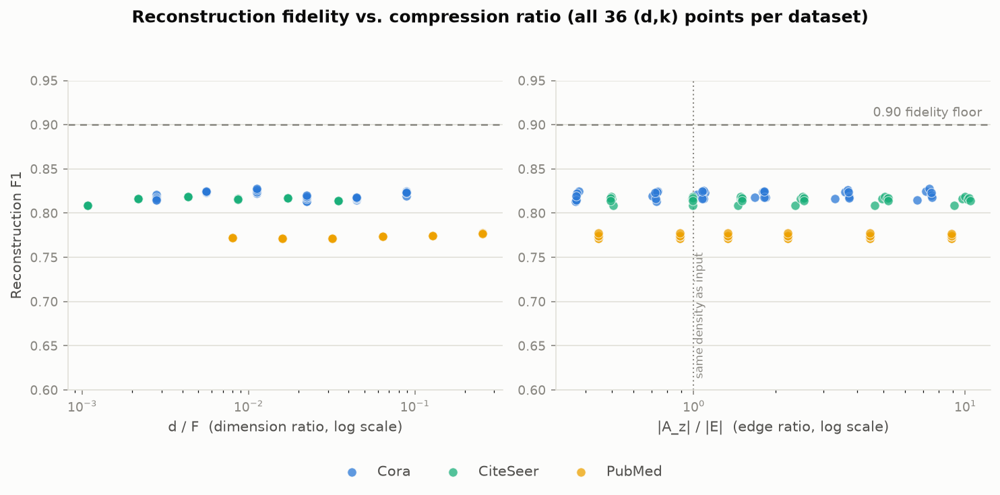
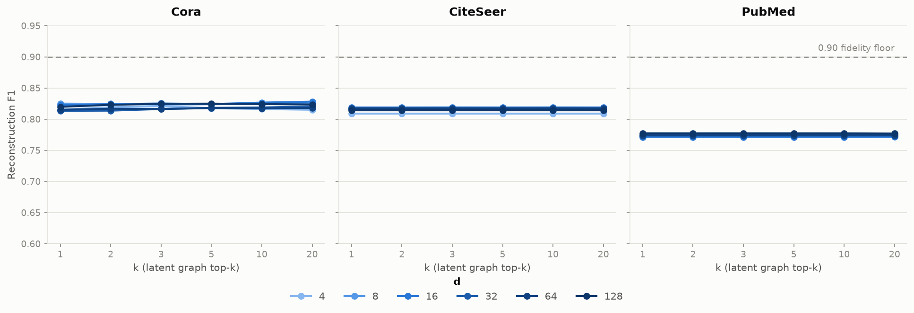
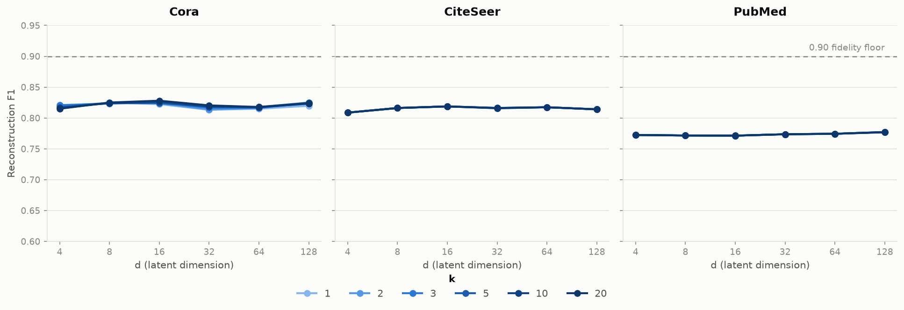

# Graph Variational Latent Space (GVLS)

A variational autoencoder where the latent space is **graph-structured** rather than flat Euclidean. Instead of mapping each node to an independent Gaussian, GVLS infers a sparse graph over the latent embeddings and refines them via message passing — learning relational structure at the latent level.


## How it works

1. **GCN Encoder** — two-layer GCN reads node features and the input graph, producing per-node mean μ and log-variance log σ² in a latent space. Samples z via reparameterization.
2. **Latent Graph Learner** — builds a sparse adjacency A_z over the latent vectors using pairwise similarity (attention, FGP cosine, or NRI), keeping the top-k neighbors per node.
3. **Latent Message Passing** — one round of diffusion on A_z refines z into z̃, letting nodes aggregate information from their latent neighbors.
4. **Inner-Product Decoder** — reconstructs the adjacency as  = σ(z̃ z̃ᵀ).
5. **ELBO Loss** — reconstruction BCE + β·KL, with optional graph-MRF prior that encodes the latent graph structure into the regularization term.

## Results

### Link Prediction — AUC

Baselines from Ahn & Kim, *"Variational Graph Normalized Autoencoders"*, CIKM 2021.

| Dataset | Train | GAE | LGAE | ARGA | GIC | sGraph | GNAE | VGNAE | **GVLS** |
|---------|-------|-----|------|------|-----|--------|------|-------|----------|
| Cora | 20% | 0.782 | 0.866 | 0.795 | 0.880 | 0.845 | 0.887 | **0.890** | 0.870 |
| Cora | 40% | 0.856 | 0.908 | 0.844 | 0.914 | 0.840 | 0.926 | **0.929** | 0.887 |
| Cora | 80% | 0.922 | 0.938 | 0.919 | 0.933 | 0.885 | **0.956** | 0.954 | 0.917 |
| CiteSeer | 20% | 0.786 | 0.906 | 0.750 | 0.930 | 0.928 | **0.946** | 0.941 | 0.941 |
| CiteSeer | 40% | 0.836 | 0.925 | 0.832 | 0.936 | 0.936 | 0.956 | **0.961** | 0.942 |
| CiteSeer | 80% | 0.894 | 0.955 | 0.904 | 0.962 | 0.963 | 0.965 | **0.970** | 0.929 |
| PubMed | 20% | 0.937 | 0.946 | 0.936 | 0.950 | 0.837 | 0.950 | **0.951** | 0.835 |
| PubMed | 40% | 0.959 | 0.962 | 0.955 | 0.958 | 0.876 | 0.963 | **0.964** | 0.884 |
| PubMed | 80% | 0.967 | 0.974 | 0.973 | 0.960 | 0.896 | 0.975 | **0.976** | 0.934 |

### Link Prediction — AP

| Dataset | Train | GAE | LGAE | ARGA | GIC | sGraph | GNAE | VGNAE | **GVLS** |
|---------|-------|-----|------|------|-----|--------|------|-------|----------|
| Cora | 20% | 0.793 | 0.878 | 0.806 | 0.881 | 0.829 | **0.901** | **0.901** | 0.876 |
| Cora | 40% | 0.861 | 0.915 | 0.856 | 0.911 | 0.828 | **0.936** | 0.933 | 0.898 |
| Cora | 80% | 0.930 | 0.945 | 0.927 | 0.929 | 0.867 | 0.957 | **0.958** | 0.909 |
| CiteSeer | 20% | 0.797 | 0.913 | 0.777 | 0.934 | 0.897 | **0.953** | 0.948 | 0.946 |
| CiteSeer | 40% | 0.850 | 0.929 | 0.844 | 0.938 | 0.910 | 0.958 | **0.966** | 0.948 |
| CiteSeer | 80% | 0.903 | 0.959 | 0.915 | 0.966 | 0.943 | 0.970 | **0.971** | 0.939 |
| PubMed | 20% | 0.940 | 0.947 | 0.941 | 0.947 | 0.859 | **0.950** | 0.949 | 0.843 |
| PubMed | 40% | 0.961 | 0.961 | 0.959 | 0.956 | 0.879 | 0.961 | **0.963** | 0.884 |
| PubMed | 80% | 0.967 | 0.975 | **0.976** | 0.965 | 0.902 | 0.975 | **0.976** | 0.923 |

> GVLS uses per-dataset NAS best configs.

### Graph Compression

Phase 3 asks a different question than link prediction: how small can (z̃, A_z) be made relative to the input graph (X, A) while still reconstructing it? A dedicated rate-distortion sweep trains a fresh model at every `latent_dim × k` grid point on the **full graph** (all edges, no held-out split — see `specs/phase3/plan.md`), independent of the AUC-optimal `k` that Phase 2's NAS chose.

#### Cora

Full results: [`results/compression/cora.csv`](results/compression/cora.csv) (36 points, 200 epochs each). Input graph: N=2708 nodes, F=1433 features, |E|=5278 edges.

| d | k | d/F | \|A_z\|/\|E\| | F1 | bits/edge |
|---|---|-----|------------|-----|-----------|
| 4 | 1 | 0.0028 | 0.368 | 0.815 | 1.088 |
| 8 | 1 | 0.0056 | 0.377 | 0.825 | 1.077 |
| 16 | 1 | 0.0112 | 0.372 | 0.822 | 1.091 |
| 32 | 1 | 0.0223 | 0.367 | 0.813 | 1.146 |
| 64 | 1 | 0.0447 | 0.368 | 0.815 | 1.224 |
| 128 | 1 | 0.0893 | 0.368 | 0.820 | 1.412 |
| 16 | 20 | 0.0112 | 7.369 | **0.828** | 1.094 |
| 128 | 20 | 0.0893 | 7.490 | 0.823 | 1.381 |

**Findings:**
- **`k` controls compression, not `d`.** At `k=1`, A_z has ~37% as many edges as the input graph — genuine structural compression — while every `k≥2` makes A_z *denser* than the input (up to 7.5× at `k=20`, the NAS-best value chosen for link-prediction AUC, not compression). This confirms the concern flagged in `specs/phase3/plan.md`: an AUC-optimal `k` and a compression-optimal `k` are different numbers.
- **Reconstruction F1 is flat across the entire grid** — 0.813 to 0.828 (a 1.5-point spread) across all 36 combinations of `d ∈ {4,…,128}` and `k ∈ {1,…,20}`. More latent capacity buys essentially nothing. This points at the plain inner-product decoder (`σ(z̃_i · z̃_j)`) as the bottleneck, not the compression ratio itself.
- **No grid point met the 0.90 fidelity floor** — even the largest tested capacity (`d=128, k=20`) only reaches F1=0.823. Per `specs/phase3/plan.md`'s T3.4 trigger condition, this **fires the conditional decoder fallback** (an explicit A_z-conditioned decoder) for Cora.
- The best trade-off is arguably **d=8, k=1**: F1=0.825 (near the grid's best) at d/F=0.56% and only 37.7% of the input's edge count — matching the best raw-F1 point (d=16, k=20, F1=0.828) almost exactly, at a fraction of the size on both axes.

#### PubMed

Full results: [`results/compression/pubmed.csv`](results/compression/pubmed.csv) (36 points, run on a remote A100 given PubMed's NAS-best `prior=graph_mrf` O(N³) KL term). Input graph: N=19717 nodes, F=500 features, |E|=44324 edges.

**Rerun 2026-07-13 after an ELBO bug fix — numbers below supersede the original run.** The first version of this grid (run 2026-07-08) showed F1 *declining* monotonically with capacity, with PubMed's own Phase 2 NAS-best architecture landing on the worst point in the grid. That turned out to be an artifact of a KL-normalization bug (`kl_isotropic`/`kl_graph_mrf` in `src/gvls/losses/elbo.py` returned an un-normalized sum over node count, so `β·KL`'s magnitude scaled with `N` while the mean-reduced reconstruction loss didn't — see `specs/phase3/validation.md` V-8 for the full diagnosis). The original numbers and findings are kept below the table as a historical record since the bug's symptom is itself an instructive result; the table and bullets reflect the corrected rerun.

| d | k | d/F | \|A_z\|/\|E\| | F1 | bits/edge |
|---|---|-----|------------|-----|-----------|
| 4 | 1 | 0.0080 | 0.445 | 0.772 | 1.125 |
| 8 | 1 | 0.0160 | 0.445 | 0.772 | 1.129 |
| 16 | 1 | 0.0320 | 0.445 | 0.771 | 1.129 |
| 16 | 2 | 0.0320 | 0.890 | 0.771 | 1.129 |
| 32 | 1 | 0.0640 | 0.445 | 0.774 | 1.137 |
| **128** | **1** | **0.2560** | **0.445** | **0.777** | **1.128** |
| 128 | 20 | 0.2560 | 8.886 | 0.777 | 1.129 |

**Findings — now much closer to Cora and CiteSeer's flat pattern than the original run suggested:**
- **Capacity no longer hurts.** F1 by `d`, averaged over `k`: 0.7725 (`d=4`) → 0.7716 → 0.7713 → 0.7736 → 0.7744 → **0.7771** (`d=128`) — a shallow dip then a rise, the opposite of the original run's clean monotonic decline. `d=128, k=20` (PubMed's Phase 2 NAS-best architecture) is now F1=0.7768, essentially tied for the *best* point in the grid instead of the worst.
- **`k` has (almost) zero effect on F1, for the same mechanistic reason as CiteSeer.** Mean F1 by `k` is now 0.7734 at every single value of `k` (1 through 20), to 4 decimal places. PubMed's compression-optimal config uses `mp_rounds=0`, so `A_z` never reaches the reconstruction logits directly — its only path into training is through the `graph_mrf` KL term. Before the fix, that KL term was artificially amplified (unnormalized sum over `N=19717`), so even A_z's indirect, KL-only influence produced large, real differences in F1 as `k` changed. With the KL correctly scaled, that indirect influence shrinks to negligible — matching CiteSeer's "`k` is decorative" finding, just via a different mechanistic route (CiteSeer's `A_z` has *no* path into the loss at all; PubMed's has a path, but it's now too weak to matter).
- **`bits_per_edge` is no longer suspiciously exact.** The original run showed `bits_per_edge` within 1.6e-3 of exactly 1.0 at every grid point — flagged at the time as "worth investigating, not yet root-caused." That near-perfect uniformity is best explained by the same bug: the dominant KL term was forcing `μ` into a very similar near-zero configuration regardless of `(d,k)`, so the reconstruction logits (and thus `bits_per_edge`) barely varied either. Post-fix, `bits_per_edge` is a real, still-imperfect ~1.13–1.14 across the grid (versus the 1.0 "random predictor" reference) — calibration remains a separate, unresolved issue (see the T3.6 pooling-sweep analysis for the same pattern), but it's no longer a suspicious artifact.
- **`k` still controls edge compression the same way as Cora**: `k=1` gives `|A_z|` at ~44–45% of the input's edge count (genuine compression) across all `d`; `k≥2` again makes A_z denser than the input, up to 8.9× at `k=20`.
- **The best trade-off point is arguably `d=4, k=1`**: F1=0.7725 — only 0.005 below the grid's best (`d=128,k=1`, F1=0.7772) — at `d/F=0.008`, 32× smaller than the new best point's dimensionality ratio, and the same edge ratio (0.445, since edge ratio only depends on `k`).
- **No grid point met the 0.90 fidelity floor** (max F1 = 0.777 at `d=128, k=1`) — same conclusion as before, T3.4's decoder-fallback trigger still fires, but the *reasoning* has changed: this is now a flat plateau well short of 0.90 (like Cora and CiteSeer), not a declining curve where more capacity actively makes things worse.

<details>
<summary>Original run (2026-07-08, predates the ELBO fix) — kept as a historical record</summary>

| d | k | d/F | \|A_z\|/\|E\| | F1 | bits/edge |
|---|---|-----|------------|-----|-----------|
| 4 | 1 | 0.0080 | 0.445 | 0.708 | 1.0000017 |
| 8 | 1 | 0.0160 | 0.444 | 0.757 | 1.0000017 |
| 16 | 1 | 0.0320 | 0.441 | 0.760 | 1.0000038 |
| 16 | 2 | 0.0320 | 0.882 | **0.761** | 1.0000073 |
| 32 | 1 | 0.0640 | 0.434 | 0.749 | 1.0000164 |
| 128 | 1 | 0.2560 | 0.422 | 0.739 | 1.0000701 |
| 128 | 20 | 0.2560 | 8.725 | 0.673 | 1.0015761 |

More capacity made reconstruction *worse*: mean F1 fell monotonically as `k` grew (0.745 at `k=1` → 0.716 at `k=20`), and at fixed `k=20`, F1 fell monotonically as `d` grew too (0.742 at `d=4` → 0.673 at `d=128`). `bits_per_edge` was degenerate — essentially exactly 1.0 bit at every grid point (1.0000017–1.0015761). Both are now understood to be symptoms of the KL-normalization bug fixed in `src/gvls/losses/elbo.py` — see `specs/phase3/validation.md` V-8.

</details>

#### CiteSeer

Full results: [`results/compression/citeseer.csv`](results/compression/citeseer.csv) (36 points, 200 epochs each). Input graph: N=3327 nodes, F=3703 features, |E|=4552 edges.

| d | k | d/F | \|A_z\|/\|E\| | F1 | bits/edge |
|---|---|-----|------------|-----|-----------|
| 4 | 1 | 0.0011 | 0.504 | 0.8087 | 1.1044 |
| 8 | 1 | 0.0022 | 0.499 | 0.8161 | 1.0803 |
| 16 | 1 | 0.0043 | 0.496 | 0.8187 | 1.0632 |
| 16 | 3 | 0.0043 | 1.489 | **0.8188** | 1.0632 |
| 32 | 1 | 0.0086 | 0.494 | 0.8160 | 1.0682 |
| 128 | 20 | 0.0346 | 10.451 | 0.8140 | 1.1422 |

**Findings — a third, distinct pattern:**
- **`k` has essentially zero effect on F1, for a mechanistic reason, not an empirical one.** CiteSeer's Phase 2 NAS-best config is `mp_rounds=0, prior=isotropic`. With `mp_rounds=0`, `z̃ = z` unconditionally (message passing is skipped, per `GVLS.forward` in `src/gvls/models/gvls.py`), so `A_z` never touches `z̃` or the reconstruction logits. With `prior=isotropic`, the KL term (`kl_isotropic`) only uses `μ, log σ²` — it doesn't touch `A_z` either. So for this config, **`A_z` has no path into the loss or the output at all** — varying `k` only changes a value that's computed and then discarded. Confirmed in the data: F1 is bit-identical across all 6 `k` values at `d=4, 8, 128`; at `d=16, 32, 64` there's a residual difference on the order of 1e-4, too large to be float32 rounding noise but with no plausible causal path from `k` found in the code (no stochastic ops in `LatentGraphLearner` — `topk` is deterministic, `log_tau` inits to a constant) — most likely floating-point non-determinism from parallel execution accumulating over 200 epochs, not a real effect of `k`.
- **`|A_z|/|E|` still varies with `k` exactly like Cora and PubMed** (`k=1` → ~49–50% of the input's edge count; `k≥2` → denser than input, up to 10.5× at `k=20`) — but for CiteSeer's config this is a purely decorative axis: it changes the size of a tensor that has zero effect on model behavior.
- **F1 ceiling (0.819) and range (0.809–0.819, a 1-point spread) are close to Cora's** (0.813–0.828) — both datasets plateau well short of the 0.90 floor, unlike PubMed's actively-declining curve.
- **No grid point met the 0.90 floor.** T3.4's trigger fires for CiteSeer too — the third dataset in a row. `configs/compression/citeseer.yaml` was written via the fallback (highest raw F1: `d=16, k=3`, F1=0.8188).

**Cross-dataset pattern, now that all three are in (updated 2026-07-13 after the PubMed rerun):** none of Cora, CiteSeer, or PubMed reach the 0.90 fidelity floor anywhere in their 36-point grids, and **all three now show the same flat-vs-(d,k) pattern** — PubMed's original declining curve is gone. Two of three NAS-best configs (CiteSeer, PubMed) use `mp_rounds=0` — meaning GVLS's core "latent message passing" mechanism is inactive in the configurations actually used for the majority of these compression runs. For CiteSeer, the entire latent graph `A_z` is provably inert (no path into the loss at all). For PubMed, `A_z` has a path only through the `graph_mrf` KL term, and — now that the KL is correctly normalized (`specs/phase3/validation.md` V-8) — that path is too weak to move F1 meaningfully either. So for two of the three datasets, the flatness has a shared root cause: `A_z` barely (or doesn't at all) influence the objective these configs actually train against. This is a strong, convergent signal that the plain inner-product decoder (or more precisely, the disconnect between `A_z` and the decoding path) is the real bottleneck for reaching the 0.90 floor — see T3.4 in `specs/phase3/plan.md`.

#### Rate-distortion curves

The flat/declining/inert patterns described above, side by side (dashed line = the 0.90 fidelity floor; regenerate with `python experiments/plot_compression_curves.py`):

**F1 vs. compression ratio** — the actual rate-distortion curve, all 36 `(d,k)` points per dataset, colored by dataset since the ratio axes are dimensionless and directly comparable across datasets. All three datasets now form tight, flat clusters regardless of compression ratio (regenerated 2026-07-13 after the PubMed rerun — PubMed no longer spreads or trends downward):



**F1 vs. k** (colored by latent dimension `d`) — none of the three datasets move meaningfully with `k` anymore:



**F1 vs. d** (colored by `k`) — CiteSeer collapses to a single visible line since none of the 6 `k` series are distinguishable (the "`A_z` is inert" finding, made visible); PubMed is now flat-to-gently-rising rather than peaking at `d=16` and falling off:



## Usage

```bash
# Train with default config (Cora)
python experiments/train_gvls.py

# Train with NAS-found best config
python experiments/train_gvls.py model=best/cora

# Run hyperparameter search
python experiments/nas.py data=cora

# Run the graph-compression rate-distortion sweep
python experiments/compression_sweep.py data=cora
```

## Project structure

```
src/gvls/
  data/        # dataset loaders, edge splitting, full-graph split
  models/      # encoder, latent graph learner, full GVLS model
  losses/      # ELBO with isotropic and graph-MRF KL
  eval/        # link-prediction metrics + compression metrics (F1, ratios)
  nas/         # Optuna search space and objective
  compression/ # rate-distortion sweep (train/eval/select per grid point)
experiments/
  train_gvls.py         # training entry point (Hydra + W&B)
  nas.py                # NAS entry point
  compression_sweep.py  # graph-compression rate-distortion sweep
configs/
  model/best/     # NAS-found best configs per dataset (link prediction)
  compression/    # NAS-found best configs per dataset (compression)
```

Full compression results: `results/compression/{dataset}.csv`.
